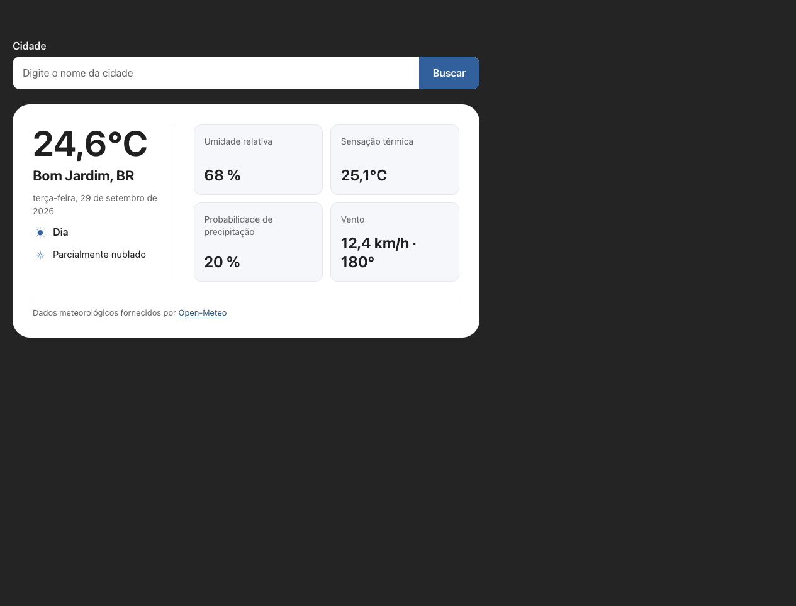

# Clima

Aplicação web para buscar cidades e consultar as condições meteorológicas atuais, com informações como temperatura, sensação térmica, umidade e vento. Os dados são fornecidos pela API Open-Meteo.

Desenvolvido como parte dos estudos no curso **Fullstack com IA**, da B7Web.

## Deploy

O GitHub Actions publica a aplicação no GitHub Pages a cada push para `main`. Na primeira publicação, configure o repositório em **Settings > Pages > Build and deployment** para usar **GitHub Actions** como fonte. Depois, acesse a aplicação em https://mpdevtech.github.io/app-clima/.
